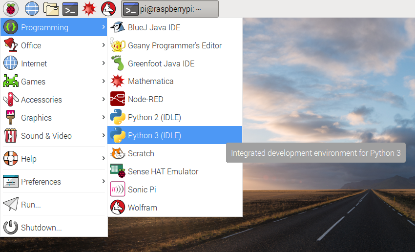
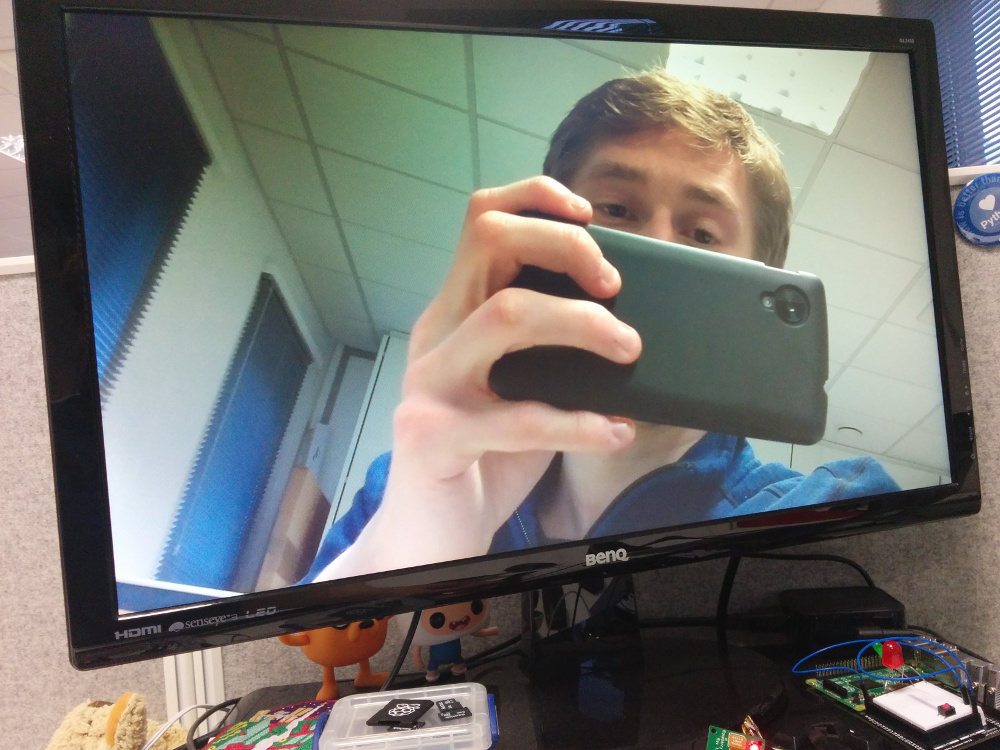

## Camera preview

Now your camera is connected and the software is enabled, you can get started by trying out the camera preview.

- Open **Python 3** from the main menu:

    

- Open a new file and save it as `camera.py`. It's important that you **do not** save it as `picamera.py`.

- Enter the following code:

    ```python
    from picamera import PiCamera
    from time import sleep

    camera = PiCamera()

    camera.start_preview()
    sleep(10)
    camera.stop_preview()
    ```

- Save with **Ctrl + S** and run with **F5**. The camera preview should be shown for 10 seconds, and then close. Move the camera around to preview what the camera sees.

    The live camera preview should fill the screen like so:

    
    
    **Note that the camera preview only works when a monitor is connected to the Pi, so remote access (such as SSH and VNC) will not allow you to see the camera preview**

- If your preview was upside-down, you can rotate it with the following code:

    ```python
    camera.rotation = 180
    camera.start_preview()
    sleep(10)
    camera.stop_preview()
    ```

    You can rotate the image by `90`, `180`, or `270` degrees, or you can set it to `0` to reset.

- You can alter the transparency of the camera preview by setting an alpha level:

    ```python
    from picamera import PiCamera
    from time import sleep

    camera = PiCamera()

    camera.start_preview(alpha=200)
    sleep(10)
    camera.stop_preview()
    ```

    `alpha` can be any value between `0` and `255`.

