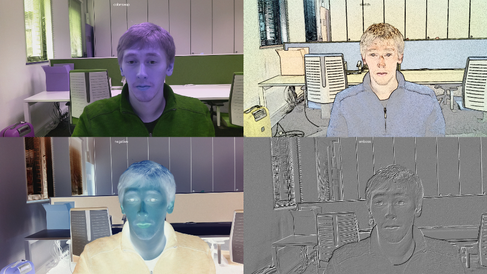

## Effects

At the beginning, you created a `camera` object with `camera = PiCamera()`. You can manipulate this `camera` object in order to configure its settings. The camera software provides a number of effects and other configurations you can apply. Some only apply to the preview and not the capture, others apply to the capture only, but many affect both.

- The resolution of the capture is configurable. By default it's set to the resolution of your monitor, but the maximum resolution is 2592 x 1944 for still photos and 1920 x 1080 for video recording. Try the following example to set the resolution to max. Note that you'll also need to set the frame rate to `15` to enable this maximum resolution:

    ```python
    camera.resolution = (2592, 1944)
    camera.framerate = 15
    camera.start_preview()
    sleep(5)
    camera.capture('/home/pi/Desktop/max.jpg')
    camera.stop_preview()
    ```

- The minimum resolution allowed is 64 x 64. Try taking one at that resolution.

- You can easily add text to your image with `annotate_text`. Try it:

    ```python
    camera.start_preview()
    camera.annotate_text = "Hello world!"
    sleep(5)
    camera.capture('/home/pi/Desktop/text.jpg')
    camera.stop_preview()
    ```

- You can alter the brightness setting, which can be set from `0` to `100`. The default is `50`. Try setting it to another value:

    ```python
    camera.start_preview()
    camera.brightness = 70
    sleep(5)
    camera.capture('/home/pi/Desktop/bright.jpg')
    camera.stop_preview()
    ```

- Try adjusting the brightness in a loop, and annotating the display with the current brightness level:

    ```python
    camera.start_preview()
    for i in range(100):
        camera.annotate_text = "Brightness: %s" % i
        camera.brightness = i
        sleep(0.1)
    camera.stop_preview()
    ```

- Similarly, try the same for the contrast:

    ```python
    camera.start_preview()
    for i in range(100):
        camera.annotate_text = "Contrast: %s" % i
        camera.contrast = i
        sleep(0.1)
    camera.stop_preview()
    ```

- You can set the annotation text size with the following code:

    ```python
    camera.annotate_text_size = 50
    ```

    Valid sizes are `6` to `160`. The default is `32`.

- You can also alter the annotation colours. First of all, ensure that `Color` is imported by amending your `import` line at the top:

    ```python
    from picamera import PiCamera, Color
    ```

    Then amend the rest of your code as follows:

    ```python
    camera.start_preview()
    camera.annotate_background = Color('blue')
    camera.annotate_foreground = Color('yellow')
    camera.annotate_text = " Hello world "
    sleep(5)
    camera.stop_preview()
    ```

- You can use `camera.image_effect` to apply a particular image effect. The options are: `none`, `negative`, `solarize`, `sketch`, `denoise`, `emboss`, `oilpaint`, `hatch`, `gpen`, `pastel`, `watercolor`, `film`, `blur`, `saturation`, `colorswap`, `washedout`, `posterise`, `colorpoint`, `colorbalance`, `cartoon`, `deinterlace1`, and `deinterlace2`. The default is `none`. Pick one and try it out:

    ```python
    camera.start_preview()
    camera.image_effect = 'colorswap'
    sleep(5)
    camera.capture('/home/pi/Desktop/colorswap.jpg')
    camera.stop_preview()
    ```

- Try looping over the various image effects in a preview to test them out:

    ```python
    camera.start_preview()
    for effect in camera.IMAGE_EFFECTS:
        camera.image_effect = effect
        camera.annotate_text = "Effect: %s" % effect
        sleep(5)
    camera.stop_preview()
    ```

    

- You can use `camera.awb_mode` to set the auto white balance to a preset mode to apply a particular effect. The options are: `off`, `auto`, `sunlight`, `cloudy`, `shade`, `tungsten`, `fluorescent`, `incandescent`, `flash`, and `horizon`. The default is `auto`. Pick one and try it out:

    ```python
    camera.start_preview()
    camera.awb_mode = 'sunlight'
    sleep(5)
    camera.capture('/home/pi/Desktop/sunlight.jpg')
    camera.stop_preview()
    ```

    You can loop over the available auto white balance modes with `camera.AWB_MODES`.

- You can use `camera.exposure_mode` to set the exposure to a preset mode to apply a particular effect. The options are: `off`, `auto`, `night`, `nightpreview`, `backlight`, `spotlight`, `sports`, `snow`, `beach`, `verylong`, `fixedfps`, `antishake`, and `fireworks`. The default is `auto`. Pick one and try it out:

    ```python
    camera.start_preview()
    camera.exposure_mode = 'beach'
    sleep(5)
    camera.capture('/home/pi/Desktop/beach.jpg')
    camera.stop_preview()
    ```

    You can loop over the available exposure modes with `camera.EXPOSURE_MODES`.

